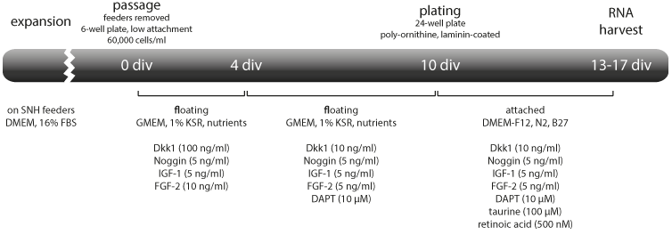

# An Introduction to Primer Design for Polymerase Chain Reaction

In this self-paced tutorial you will design primers for several applications, such as cloning a gene to create a fusion protein or reverse transcription-PCR to monitor gene expression. Each example will teach you different aspects and familiarise you with software and online-tools.

## Core primer properties

Let's recall a few key concepts from the lecture. Primers should generally have the following properties:

  1. **Sufficient length to guarantee specific binding.** Shorter primers bind more easily to the template during the annealing stage, whilst longer primers confer more specificity. Generally the complementary regions of your primers should be 18-24 bases long.

  A primer with a length of 18nt, will randomly bind once every $4^{18}$ bases, or roughly once very 68 billion nucleotides. Due to conversation amongst genes, this isn't quite as straightforward, but we will learn how to test for primer specificity later.

2. **40-60% G/C content.** GC-bonds are stronger than AT bonds, and a high GC-content can lead to mis-pairing and therefore reduced specificity. Whenever possibly you should avoid GC-rich regions. If unavoidable, GC-rich specific polymerases and addition of DMSO to your reaction may increase the PCR's yield.

    Conversely, AT-rich regions can lead to poor results due to reduced specificity of annealing at low melting temperatures.

3. **Melting temperature (T$_m$) of 50-60°C.** By definition, at the T$_m$ half of a primer duplex dissociates to its single stranded form. Primers with high T$_m$s above 65°C can lead to mismatches in annealing.

    The length and GC-content contribute to the melting temperature of a primer. As GC-bonds contribute more hydrogen bonds, it stabilises the DNA duplex and increases the T$_m$.
    
    The Wallace rule can be used roughly to estimate melting temperatures for relatively short oligonucleotides of 14-20bp (T$_m$ = 4°C/GC + 2°C/AT). However, modern approaches employ more complicated methods using the nearest neighbour thermodynamic theory (more information can be found on the [description page of IDT's OligoAnalyzer](https://www.idtdna.com/calc/Analyzer/Home/Definitions)).
    
    The annealing temperature (T$_a$) is often set 5°C below the lower T$_m$ of the primer pair, or calculated as shown below. Though ideally is confirmed experimentally.
    
    $$
    T_a = (0.3 \times T_{m(primer)} + 0.7\times T_{m(product)}) – 14.9
    $$
    
    Whereby, T$_{m(primer)}$ is the T$_m$ of the less stable primer-template pair and T$_{m(product)}$ is the T$_m$ of the PCR amplicon.
    
    Too high of an annealing temperature reduces PCR yield due to reduced annealing of the primers on their target sequence, whilst too low a T$_a$ will lead to secondary annealing and nonspecific amplification.
    
4. **Primer pairs should have a T$_m$ within 5°C of each other.** Too large of a difference will cause problems with finding an agreeable annealing temperature as described above.

5. **Primers should not form 2° structures. Primer pairs should not have complementary regions.** The formation of hairpins can result in self-priming, and/or prevent the primer from annealing to its target. Similarly, complementary regions between the primer pairs leads to competition between primers and target and can result in the formation of primer dimers through extension. Limited low energy secondary structures in the centre of the primers are usually tolerated during design.

    <!--$\Delta$G-->

6. **Include 1-2 G/C pairs in the 3' end ("GC-clamp").** This is a contentious point amongst molecular biologist. It is argued that 1-2 G or C bases within the last five bases of the 3' end of the primer helps promote specific binding due to the stronger hydrogen bonding of G or C bases. More than 3 G/Cs should be avoided.

## The best primers ...

... are primers that have already been published; as this means the primers have successfully been used and validated. Using someone else's primers can be as easy as finding an appropriate publication and diving into the method section. It then becomes a copy & paste job to reorder the primers from a supplier such as Sigma-Aldrich, Eurofins or IDT.

Occasionally, papers will send you on a bit of a wild-goose chase, when methods are not quoted in full and are referenced (sometimes) over several articles, e.g.

>RT-PCR was carried out as previously described (Mullis, 1983).

---

**Exercise:** Find an RT-PCR primer pair for a house-keeping gene such as *GADPH* (glyceraldehyde-3-phosphate dehydrogenase, glycolysis), *Actb* (beta-actin, structural) or *16S rRNA* (ribosomal component), which can be used as a control for a differentiation experiment in _mouse_ embryonic stem cells.

---

## Designing RT-PCR primers for a mammalian mRNA

Reverse Transcription PCR is still widely applied to check for the presence of specific RNA transcripts in a variety of circumstances.

In the following example, mouse embryonic stem cells were treated with a cocktail of morphogens and growth factors over several days *in vitro* (div, see figure below). The aim was to differentiate the cells towards a forebrain and eventually retinal lineage.



In order to assess the progress of this differentiation routine, a proportion of cells was harvested at frequent intervals and their RNA isolated. The RNA was then screened with RT-PCR for the the *cone-rod homoeobox (Crx)* transcript - a gene expressed almost exclusively in cone and rod photoreceptors of the retina.

In the (cropped) figure of an electrophoresis gel below, you can see *Crx* expression increasing after treating the cells for 3 div. Beta-Actin (*Actb*), a structural cellular component, was used as a control.


The *Crx* primers used for this experiment are listed below. Remember, by convention, primers are always written in 5' to 3' direction. The T$_a$ was determined to be 60°C and the expected amplicon size is 494bp. 

```
forward: CACCAGGCTGTCCCATACTC
reverse: TAAGGGGCTGAGGTGAGAGA
```

The NCBI-tool [Primer-BLAST](https://www.ncbi.nlm.nih.gov/tools/primer-blast/) provides an easy way to check primers. It combines BLAST's global sequence alignment capabilities with [Primer3](http://primer3.ut.ee/); a software designed to pick primer pairs according to an elaborate list of input parameters - including some of the discussed core primer properties.

---

**Exercise:** Check the *Crx* primers using Primer-BLAST. Besides the target mouse species, what other targets are there? Are they likely to cause an issue in the intended application?

Also check the control primers you previously unearthed from a published source.

---

A common procedure for RNA isolation is acidic phenol-chloroform extraction from lysates, whereby genomic DNA (gDNA) precipitates in the hydrophobic chloroform phase and RNA remains in solution in the aqueous phase. Carry-over of gDNA occasionally happens if the interphase is disturbed.


This poses the problem of potentially having a genomic DNA template present in your PCR, whilst the gene of interest may _not_ expressed. In order to distinguish between a signal obtained from gDNA contamination and cDNA (reverse transcribed from an expressed mRNA), RT-PCR primers are, whenever possible, designed across exon-exon junctions.

```
primers surrounding exon-exon junction
--->                      <---
============~~~~~~~~~~~~~==========~~~~~~~~~~========== gDNA sequence
    exon       intron       exon     intron     exon

--->========~~~~~~~~~~~~~=<--- gDNA amplicon
--->=========<--- cDNA amplicon

primer (also) bridging exon-exon junction
          --             ->                   <---
============~~~~~~~~~~~~~==========~~~~~~~~~~========== gDNA sequence
    exon       intron       exon     intron     exon

          no specific gDNA amplicon
          --->=========<--- cDNA amplicon
```

In fully processed mRNAs and thus its cDNA, introns are excised during splicing, whilst genomic sequences contains introns. Primers surrounding an exon-exon junction will consequently generate differently sized products for spliced cDNA and genomic DNA.

An alternative strategy is to place a primer directly onto the exon-exon junction site, which prevents specific annealing on gDNA.

Before designing primers, it is a good idea to get a better idea of your target gene's exon-intron structure and particularly its main transcripts. Do you want to target all splice variants, or just a specific one?

You can explore the genomic locus of your target gene using a genome browser, such as [Ensembl](http://www.ensembl.org/index.html) (or [UCSC Genome Browser](https://genome.ucsc.edu/)) .

---

**Exercise:** Explore the mouse *Crx* locus. Where do the *Crx* primers anneal? You will have to consult your primer-BLAST results for this. Could they be used to detect all transcripts?

---

A whole set of *Crx* primers were originally designed 'by hand' using [NCBI reference](https://www.ncbi.nlm.nih.gov/nuccore/NM_007770) [sequences](https://www.ncbi.nlm.nih.gov/nuccore/NM_001113330) and [Primer3](http://primer3.ut.ee/). Besides a plethora of variable settings, Primer3 also provides syntax that can be used to force-include sequences in the final amplicon. These can simply be highlighted to the input sequence (`[ATGC]`).

```
Proportion of Crx cDNA sequence
    ...
361 acccggatgt gtatgcacgt gaggaggttg ctcttaagat caatctgcct gagtccaggg
421 [tccaggtctg] gttcaagaat cgtagggcga aatgcagaca gcagcgacag cagcagaaac
481 agcaacagca gcccccgggg gcacagacca aggctcgtcc tgcgaagagg aaggcaggga
    ...
```
Alternatively, targets, included and excluded regions (e.g. an exon that isn't shared between all transcripts), as well as exon-exon junctions that should be overlapped by the primers can be defined by nucleotide position.


---

**Exercise**: Now that you are familiar with the *Crx* locus and its transcripts, let's get our hands dirty to design a few new RT-PCR primer sets with a shorter amplicon size of 100-300bp. Let the primers overlap an exon-exon junction and the amplicon span an intron.

Go the more challenging route and use the reference sequences and Primer3 first. Play with the settings (each serves as a link to the manual explanation). Then try again using the Primer-BLAST interface and see whether you get different results.

---

## Designing primers to tag a protein

Adding of a [tag](http://blog.addgene.org/plasmids-101-protein-tags) to a protein is a common task for applications such as co-immunoprecipitation assays to study protein interaction, or for protein purification. Some tags are small enough to be directly added to a target protein via PCR.

```
HA          YPYDVPDYA or YAYDVPDYA or YDVPDYASL
Frequently used for western blots, IP, co-IP, IF, flow-cytometry
can occassionally interfere with protein folding

Myc         EQKLISEEDL
Frequently used for western blots, IP, co-IP, IF, flow-cytometry
but rarely used for purification as elution requires low pH

poly-His    HHHHHH
Very small size, rarely affects function

FLAG        DYKDDDD or DYKDDDDK or DYKDDDK
Good for antibody-based purification
has inherent enterokinase cleavage site

S-tag       KETAAAKFERQHMDS
Abundance of charged and polar residues improves solubility
good for antibody-based detection
```

When designing primers for a specific protein target, we cannot rely on algorithms (yet) to pick the correct sequences. Starting off with a cDNA or plasmid with the complete protein coding sequence, you should consider the following:

1.  **Is the expression system pro- or eukaryotic?**

    * In order for a Ribosome to find the translation start site, either a [Kozak sequence](https://en.wikipedia.org/wiki/Kozak_consensus_sequence) (e.g. `(gcc)gccRccATGG` on the start codon) or a [Shine-Dalgarno sequence](https://en.wikipedia.org/wiki/Shine-Dalgarno_sequence) (`AGGAGG` ~8 bases upstream of the start codon) needs to be included.
    * Different species have different codon preferences. Reverse translate the tag sequence appropriately with a tool such as [EMBOSS Backtranseq](https://www.ebi.ac.uk/Tools/st/emboss_backtranseq/).
    * The type of expression vector needs to be selected accordingly.
    
2. **Should the tag be N- or C-terminal?**

    * For a C-terminal tag the STOP codon has to be moved downstream.
    * For an N-terminal tag the Kozal/Shine-Dalgarno sequence has to be moved upstream.
    * Either way, the tag's open reading frame (ORF) needs to be aligned with the protein's ORF.

In order to manipulate sequence files, we need a sequence editor, such as the [commercial and somewhat limited SnapGene Viewer](http://www.snapgene.com/products/snapgene_viewer/).

---

**Exercise:** Install SnapGene Viewer and watch the introductory video. Then import (file > import > NCBI sequence ...): 

*  The cDNA containing the full coding sequence (326aa) of the human Adenosine receptor 1 (*ADORA1*, 326 amino acids). You will have to find the Accession number either via Ensembl or NCBI nucleotide.
*  The shuttle vector pcDNA3.1(+) (file > import > SnapGene Online sequence)

---

You should be greeted by a purple arrow highlighting the *ADORA1* coding sequence (cds). The cds is preceded by decent Kozak motif (`CCCGCCATGC`) and ends with an amber stop codon (`TAG`).

In this example, we shall introduce a C-terminal FLAG-tag. The design of the final amplicon should be as follows:

```
spacer | RE-site 1 | Kozak | ADORA1 cds w/o stop | FLAG w/ stop | RE-site 2 | spacer
```

* In order to clone the amplicon into the pcDNA3.1(+) expression vector, we need to include restriction endonuclease (RE) sites in each of the primers.
* An overhang of 3-4 bp end (e.g. ATAT) is required at the 5' (spacer) of each primer to provide sufficient space for the RE to work efficiently; i.e. DNA for the RE to bind to.
* The forward primer will include the original Kozak sequence.
* The reverse primer will exclude the original stop codon, but introduce a new one following the FLAG sequence.

---

**Exercise:**

1. Pick two compatible restriction enzymes from the pcDNA3.1(+) multiple cloning site (MCS). REs reach optimal efficiency and importantly specificity in tailored buffer systems. However, compatible enzyme will work in a shared buffer. These can be found using a tool such as [NEB's double digest finder](https://www.neb.com/tools-and-resources/interactive-tools/double-digest-finder). If no compatible enzymes are available, digests can be carried out sequentially.

    Make sure these RE _do not_ cut within the *ADORA1* coding sequence, or else you would cut your amplicon and only clone part of it.
    
    In an actual lab setting, you would also consult your freezer, to see which RE are available. EcoRI, EcoRV, HindIII, BamHI, NheI, XhoI, XbaI and NotI (an 8bp cutter) are often staple.

2. In the sequence tab, begin highlighting the Kozak and several bases of the coding sequence. SnapGene will display a melting temperature estimate; apply what you learned earlier. After you selected the compatible region, save the primer via the menu (Primer > Add Primer).

    

3. Continuing in the primer menu you can add sequences directly to the primer (switch from 'description' to 'insertion'). Add the restriction enzyme site you chose earlier and an ATAT spacer.

4. Excluding the stop codon, select an equivalent segment of the C-terminal end of the cds. Save this primer as well. Which strand should you pick?

5. As with the forward primer, add the FLAG-tag, a stop codon, the RE site and an ATAT spacer. Should you reverse complement the insertions? Depending on the compatible region chosen, you will end up with a primer lengths of 60+ nucleotides.

---

Unfortunately, this is were SnapGene Viewer's free functionality ends. In order to carry out a virtual PCR (or just copy & paste sequences) we need to use [SerialCloner](http://serialbasics.free.fr/Serial_Cloner-Download.html).

---

**Exercise:** 

1. Install SerialCloner and copy & paste the whole GenBank reference sequence entry for *ADORA1* into the new sequence field. The menu point 'Function > Run a PCR' opens up another dialogue into which you can paste the primer sequences you generated in SnapGene Viewer. Make sure you paste the annealing and non-annealing part into the correct entry-boxes.

2. On the newly generated PCR fragment, 'Edit > Find' opens a side-menu with a rider called 'ORFs'. Check for an uninterrupted ORF running from the Kozak ATG all the way to the stop codon downstream to the FLAG-tag.

3. Finally, import pcDNA3.1(+) into SerialCloner as well and virtually clone your PCR fragment into the vector. This will highlight any last problems with restriction enzymes, e.g. cutting where they shouldn't or using them in the wrong orientation.

4. Whilst tags are small and often unobtrusive to protein function, it helps to have an alternative strategy. The C-terminus of the Adenosine receptor 1, being a GPCR, is located in the cytoplasm, while the N-terminus will face the extracellular medium. Design another set of primers to apply the FLAG-tag to the N-terminus.

    

--- 

## Designing primers to create a fusion protein

Creating a fusion protein can be a task of varying difficulty. Using vectors, which already carry one of the two proteins reduces the complexity. 

In the following example, we want to create a couple of fusion proteins to run a [Bimolecular Complementation assay (BiFC)](https://en.wikipedia.org/wiki/Bimolecular_fluorescence_complementation). Similar to FRET or BRET, a BiFC assay is used to study protein-protein interactions. It is based on the re-complementation of GFP (and it's derivates), just like the lacZ' assay is based on re-complementation: putting two non-functional pieces of protein in proximity makes a whole functional complex again.


Amongst several available plasmids, we chose [pBiFC-VC155](https://www.addgene.org/22011/), which contains the C-terminal portion of Venus (a yellow variant of green fluorescent protein) from amino acid 155 onwards, and [pBiFC-VN173](https://www.addgene.org/22010/), which contains the the first 172 amino acids of Venus.

The structure of both of these vectors is very similar. A promoter from cytomegalovirus (pCMV, a beta herpes-virus) is followed by either an HA or a FLAG tag, which is in-line with the Venus fragments and coincides with the MCS.

The actual ORF/cds for VN173 starts with `atggtgagcaagggc`, whilst VC155 starts with `atgaaccacgacaag`. These ORFs can also be found by using SerialCloners Find-function and matching the ORF size with the insert size described on the Addgene plasmid description pages (alternatively, you can figure out how many nucleotides it takes to encode 172 amino acids of VN173, or 84 amino acids of VC155).

We would like to clone *ADORA1* into pBiFC-VN173 and *AODRA2* into pBiFC-VC155. For both of these GPCRs, the C-terminus is in the cytosol. Consequently, the Venus part of the needs to be added to the C-terminus.

The challenging part is to align the receptor gene ORF with the Venus-fragment ORF. This requires careful studying of the multiple cloning site to determine which RE to use and adding alignment nucleotides into the primers where necessary.

You also need to pay attention to the 'linker' of seemingly random codons, which forms between the receptor and the fluorescent protein. You want to avoid rare amino acids such as proline (leads to kink in the chain, reduces linker flexibilty) or tryptophan (bulky an hydrophobic) or stretches of charged amino acids.

---

**Exercise:** Design primers for an ADORA1-VN173 or ADORA2-VC155 fusion protein, made in the corresponding pBiFC vector.

---

## Advanced: Golden Gate cloning for protein engineering

Type IIS restriction endonucleases, unlike 'traditional' Type II RE, cleave outside their recognition sequence, which is not palindromic and indicates the direction.

```
Traditional Type II RE - HindIII
A|A G C T T
T T C G A|A

Type IIS RE - BsaI
|N N N N G A G A C C
 N N N N|C T C T G G

cleavage sites indicated by |
```
Because the recognition sequence can be cleaved off by the TypeIIS RE itself, it can create sticky ends that leave no seam in complex cloning assemblies.

---

**Exercise:**  Learn more about Golden Gate cloning. How could this be used to introduce a tag or a larger protein into one of the intracellular loops of the Adenosine receptor 1?

---