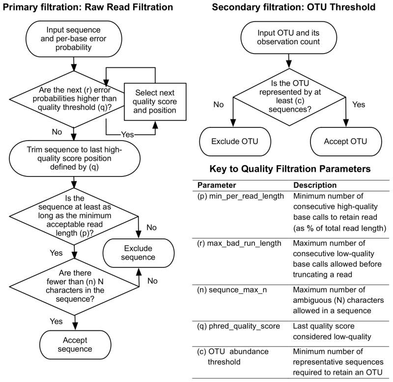
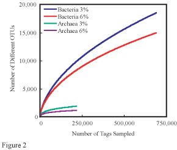
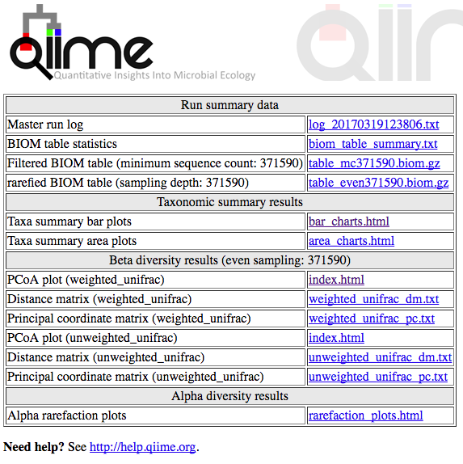

# A Quantitative Insights Into Microbial Ecology (QIIME) pipeline: From FASTQ to diversity analysis

This self-paced assisted learning tutorial covers a basic [QIIME](http://qiime.org/) workflow using data from an [Illumina MiSeq](https://www.illumina.com/systems/sequencing-platforms/miseq.html) sequencing run carried out in the academic year 2016-2017. In order to keep computing times reasonable, a subset of 50,000 sequences (by contrast to 15-25 million sequences of the full dataset) will be used.

Large parts of this SPLAT will be carried out remotely on a UCL server. As such, you should be familiar in using the `command line` to navigate the file structure and use `git` to download data. If you feel you need a refresher, please refer to the respective SPLATs.

## Getting access to UCL Aristotle

[_Aristotle_](https://wiki.rc.ucl.ac.uk/wiki/RC_Systems#Aristotle) is part of UCL's Research Compute Platform, or UCL's system of high performance compute clusters. Unlike 'traditional' HPC, _Aristotle_ is not fashioned with a [job queue](https://en.wikipedia.org/wiki/Job_queue). So, instead of having to wait for programmes to be submitted to a compute node, we can run our programmes interactively, just as you would do on your local terminal.

Once you access Aristotle, you will also notice that your home-directory (`~/`) is mapped to your central ISD filestore (`T:` drive), which has a quota of only 1GB.

As we are using a **shared and limited** computing resource, which is open to all UCL users, _Aristotle_ is to be used with consideration; e.g. don't run your full scale data analysis on _Aristotle_!

### Using secure shell (ssh)

The [secure shell (`ssh`)](https://en.wikipedia.org/wiki/Secure_Shell) is a clever cryptographical protocol that allows secure access to remote computers over networks (such as the internet). We have previously used the secure shell to connect to GitHub.

<!-- https://en.wikipedia.org/wiki/Public-key_cryptography -->

On your command line (GitBash or Mac terminal), use the `ssh` to log onto _Aristotle_ as below, whereby `<username>` needs to be replaced with your UCL userid, such as `zcbcxxx`. Following the command you will be greeted with a prompt to enter your UCL password. Please note that the password cursor won't move when you type your password.

```bash
ssh <username>@aristotle.rc.ucl.ac.uk
# prompt will ask for your UCL user password, the cursor won't move as you type
```

Should you receive the following or a similar message, confirm it by typing `yes`. _Aristotle_ (in this case) will be added to the list of known hosts.

```
The authenticity of host 'aristotle.rc.ucl.ac.uk (<no hostip for proxy command>)' can't be established.
ECDSA key fingerprint is SHA256:DWhqTad2on4D7/u6STVPXxLtC4/ZakhbZZhYmlWMJvc.
Are you sure you want to continue connecting (yes/no)?
```

Whilst you are on Aristotle, your command prompt, the first couple of letters preceeding every line, will change to `-bash-4.2$`. You can exit any remote server any time through the `exit` command.

For security reasons, _Aristotle_ cannot be accessed from outside the UCL network (you will received a timeout error). In this case, you can either install software to access the [UCL virtual private network](http://www.ucl.ac.uk/isd/services/get-connected/remote-working/vpn), or `ssh` connect to UCL _Socrates_ first and then connect from the _Socrates_ shell to _Aristotle_.

```bash
ssh <username>@socrates.ucl.ac.uk
# prompt will ask for password
ssh <username>@aristotle.rc.ucl.ac.uk
# prompt will ask for password again
```

### Adding ssh keys to the server

In order to avoid continuously having to type your password whenever you log onto remote servers, **secure shell keys** can be added to the server for password-less authentication. You can generate the keys using the `ssh-keygen` command.

```bash
ssh-keygen -t rsa
```

This will prompt a reply of `Generating public/private rsa key pair.` When you're prompted to `Enter a file in which to save the key (/Users/you/.ssh/id_rsa):` press `Enter` to accept the default location `~/.ssh`.

Finally you are prompted to enter a passphrase. Unless you are diligent about your password management and don't mind entering this frequently, I would recommend leaving the passphrase empty.

```
Enter passphrase (empty for no passphrase): [Type a passphrase]
Enter same passphrase again: [Type passphrase again]
```

You will end up with two keys in your `~/.ssh/` folder. `id_rsa.pub` is your public key, which you will share with the world, whilst `id_rsa` is your private key, which you should **not** share with anyone.

The keys can then be copied to the server the 'old-fashioned' way ...

```bash
cat ~/.ssh/id_rsa.pub | ssh <username>@aristotle.rc.ucl.ac.uk "mkdir -p ~/.ssh && cat >>  ~/.ssh/authorized_keys"
# the -p argument for mkdir makes sure this command won't fail in case the directory already exists
# && allows us to chain separte commands together, whilst >> appends the redirected output to a file
```
... or using `ssh-copy-id`.

```bash
ssh-copy-id <username>@aristotle.rc.ucl.ac.uk
```

In both cases you will have to type in your UCL account password one more time.

If you are outside the UCL network, you can do the same thing for _Socrates_, then generate ssh-keys there and copy these to _Aristotle_.

```bash
# on local terminal
ssh-copy-id <username>@socrates.ucl.ac.uk
# on socrates terminal
ssh-keygen -t rsa
# as socrates does not support ssh-copy-id
cat ~/.ssh/id_rsa.pub | ssh <username>@aristotle.rc.ucl.ac.uk "mkdir -p ~/.ssh && cat >>  ~/.ssh/authorized_keys"
```

### Creating an ssh config

Typing all these ssh-commands can become arduous quickly. Let's make it easier, by creating an **ssh config**. In `~/.ssh/`, create a text-file called `config`. There are several ways to do this, but one of the fastest is to use the editor `vim`.

```bash
cd ~/.ssh/
vim config
```

Using vim, in the editor hit `i` to change to `insert` mode, then type the text below.

```vim
Host aristotle
   User <username>
   HostName aristotle.rc.ucl.ac.uk
```

Don't forget to indent the lower two lines. When you finished typing, hit `Esc` followed by `:wq` to write and quit (you can see what you are typing in the lower left corner of the terminal window).

You should now be able to `ssh aristotle` without having to add username and the full server address. The `Host` name can be freely picked.

If you are off campus, the ssh routing via _Socrates_ can be directly incorporated in a `proxyCommand`.

```vim
Host aristotle_remote
   User <username>
   HostName aristotle.rc.ucl.ac.uk
   proxyCommand ssh -W aristotle.rc.ucl.ac.uk:22 <username>@socrates.ucl.ac.uk
```

Now there is no more need separately to connect to _Socrates_ first; `ssh aristotle_remote` should do the trick.

### Secure copy (`scp`)

With `scp` you can copy files securely across an `ssh` connection. Local file(s) to a remote location, in this case _Aristotle_.

```bash
# a single file
scp /path/to/source-file <username>@aristotle.rc.ucl.ac.uk:/path/to/destination-folder/
# multiple files
scp file1.txt file2.txt file3.txt <username>@aristotle.rc.ucl.ac.uk:/path/to/destination-folder/
# or if the files are in different locations, just include the path
scp /path/to/file1.txt /path/to/file2.txt /path/to/file3.txt <username>@aristotle.rc.ucl.ac.uk:/path/to/destination-folder/
# Copy a folder and all its contents (-r for recursive)
scp -r /path/to/source-folder <username>@aristotle.rc.ucl.ac.uk:/path/to/destination-folder/
```
To copy file(s) from a remote server to your current local server, use the following syntax.

```bash
scp <username>@aristotle.rc.ucl.ac.uk:/path/to/source-file /path/to/destination-folder
```

Because you generated an `ssh config` and added your `ssh-key` to the server, the syntax can be significantly shortened and you won't have to type passwords.

```bash
scp /path/to/source-file aristotle_remote:/path/to/destination
```

Please note: unless you local server (i.e. your computer) can be reached via an IP-address, you cannot `scp` off the Aristotle shell; you always have to initiate the copying process off your local terminal.

## Processing and analysing microbiome example data using QIIME

[QIIME](http://qiime.org/) (pronounced _chiime_, Quantitative Insights into Microbial Ecology) is a bioinformatics pipeline tool to perform microbiome analysis, starting with sequencing raw data.

The data for this exercise was obtained in the academic year 2016-17. Eight soil samples were collected from Gordon Square Gardens in London and genomic DNA was isolated. Using universal primers, the variable region 4 of 16S ribosomal RNA genes was amplified and sequenced on an Illumina MiSeq platform. A virtually identical workflow can be applied to analysing the microbiome of other niches.

Of the 15 million sequences obtained, 50,000 were randomly sampled to keep calculation times within reasonable time frames for this exercise setting (`subsampling.py` script in the data repository).

### Installing QIIME

If you are not already, secure shell connect to _Aristotle_. As _Aristotle_ is part of UCL Research Compute Platform it has access to a whole range of centrally installed software. The list of available modules can be queries using `module avail <query-term>`. Querying for Python (`module avail python`) will reveal a whole range of different Python versions.

```
------------------------------------ /shared/ucl/apps/modulefiles/development -------------------------------------
python/2.7.12          python/3.4.3           python/3.6.1/gnu-4.9.2
python/2.7.9           python/3.5.2           python/3.6.3

-------------------------------------- /shared/ucl/apps/modulefiles/bundles ---------------------------------------
python2/recommended          python3/3.5                  python3/recommended(default)
python3/3.4                  python3/3.6
```

QIIME has previously been installed and added to the `python2/recommended` stack. `module show python2` will reveal two URLs on GitHub, which list all libraries and packages that are part of the `python2` module. `module load python2` will load the module, but won't prompt any feedback.

#### QIIME on your local machine

Unfortunately, _Aristotle_ has recently experienced heavy load. By using the `htop` or `top` command, you can check the computing load. If the load is consistently at 100%, it may be necessary to install QIIME locally on your computer.

[The developers provide detailed instructions](http://qiime.org/install/install.html) on how to do this with the Python distribution `Miniconda` for Mac and Linux systems. Unfortunately, on Windows PCs you still need to use a [linux virtual machine](http://qiime.org/install/virtual_box.html).

If you don't have `Miniconda` installed yet, it can be downloaded from the [Conda website](https://conda.io/miniconda.html):

```bash
# for Mac
cd ~
curl -O https://repo.continuum.io/miniconda/Miniconda3-latest-MacOSX-x86_64.sh
bash ~/Miniconda3-latest-MacOSX-x86_64.sh

# for Linux
cd ~
curl -O https://repo.continuum.io/miniconda/Miniconda3-latest-Linux-x86_64.sh
bash ~/Miniconda3-latest-Linux-x86_64.sh
```

The installation for QIIME then becomes a straightforward one-line.

```bash
conda create -n qiime1 python=2.7 qiime matplotlib=1.4.3 mock nose -c bioconda
```

#### Loading the QIIME virtual environment

Once QIIME is loaded/installed, you need to activate the virtual environment. A virtual environment is a quasi-copy of Python, which allows developers to curate very specific version combinations of Python libraries.

```bash
source activate qiime1
```

You should notice your command prompt change again. Depending on the setup the prompt will be preceeded by `(venv)` or the name of the virtual environment `(qiime1)`. You can close the virtual environment on _Aristotle_ with `deactivate` and on your local machine with `source deactivate`.

In order to validate that all QIIME programmes are working appropriately, we can test the installation by running `print_qiime_config.py -t`. The script will output a list of dependency versions and finish with test results. If this is prompted by a `command not found` error, make sure your virtual environment is still activate.

```
QIIME base install test results
===============================
.........
----------------------------------------------------------------------
Ran 9 tests in 0.069s

OK
```

### Downloading the exercise dataset

Using [`git`](https://git-scm.com/), download a copy of the exercise data. `git` is an open-source version control system widely used by the coding community. `git` can track changes in text-files across multiple repositories and with many users.

```bash
git clone https://github.com/Cistron/bioc3301_50k ~/test_50k --depth 1
# --depth 1 will only download the last commit of the respository
```

This will start to download files into the folder `test_50k` in your home directory. Depending on the internet connection the unpacking might take up to a few minutes; so do not fret if `git` is seemingly stuck.

Inside the the folder (`cd ~/test_50k`, `ls`) you will find several files, including `map.tsv`, a tab-separated value table containing information about the samples, including the barcodes, coordinates, etc.

`read1.fastq.gz` and `barcode.fastq.gz` contain the actual sequences in [FASTQ format](https://en.wikipedia.org/wiki/FASTQ_format) and are both compressed with gzip. In order to interrogate the files on the command, you can temporarily unzip them and pipe the output, e.g. `gunzip -c <filename> | less`.

The sequences in `read1.fastq.gz` are the first read from the [Illumina MiSeq sequencing](https://www.youtube.com/watch?v=womKfikWlxM) run and are 250bp long. `barcode.fastq.gz` contains the index/barcode sequences, which are later used to assign sequences to specific samples.

Note that both these files contain 50,000 sequences and are 200,000 lines long (you can test this wih `gunzip -c <filename> | wc -l`), though this is still less than 0.3% of the full dataset with more than 15 million sequences.

### Microbiome analysis

#### Validate mapping file

The **mapping file** contains all the sample metadata, including the sample barcodes, which are quasi unique sample identifiers. In its most minial form the header line contains four compulsory columns, starting with a hashtag.

```
#SampleID	BarcodeSequence	LinkerPrimerSequence	Description
#You can then use several lines
#starting with hastags to describe
#the project (optional)
```
`LinkerPrimerSequence` is needed for some QIIME workflows and included for legacy support. However, unlimited columns can be added to include metadata, such a pH or the soil mineral concentrations you determined in the lab. The QIIME documentation also provides [detailed information on mapping files](http://qiime.org/documentation/file_formats.html#metadata-mapping-files).

As Excel produces broken tab-seperated-value (`.tsv`) files by omitting the line breaks and errors in barcodes (such as duplications) sometimes happen, it is a always good idea to check the mapping files for mistakes.

Don't forget to change directory into the data directory (`cd ~/test_50k`), or your file paths will be off.

```bash
validate_mapping_file.py -m map.tsv -o ./vmf
# The output path (-o) can be anything you chose
```

You should receive immediate feedback on the command line standard out (i.e. what you read on the screen); this message will also be logged in the text-file `./vmf/map.tsv.log`. Any mistakes will be highlighted in `./vmf/maps.tsv.html`. As _Aristole_ doesn't provide a graphical user interface, you will have to copy these files to your local machine using `scp` (see above on how to do this).

The repository also contains a mapping file with deliberate errors, called `map_errors.tsv`. Explore what output this would provide.

#### Demultiplexing and quality filtering

With growing capcities, modern high-throughput sequencing has departed from splitting samples onto separates physical lanes and the use of barcodes allows the muliplexing (i.e. mixing) of thousands of samples on a single sequencing flow cell. This works, as both sequence and barcode are on the same piece of DNA which is anchored to the flow-cell surface. For a refresher watch the [Illumina animation on sequencing by synthesis](https://www.youtube.com/watch?v=womKfikWlxM). During demulitplexing, barcodes, and thus sample identities, are re-assigned to specific sequences.

Based on sequence quality scores included in the [FASTQ](https://en.wikipedia.org/wiki/FASTQ_format) files, the sequences are also filtered or truncated (see [Bokulich et al, 2013](10.1038/nmeth.2276) for a deeper discussion of the topic and the right hand side of figure below from the same paper).



Illumina's exact method for the calculation of quality scores is proprietary and relies on adding the known bacteriophage **PhiX** genome to the sequencing runs. Base call error rates (quality scores) can then be extrapolated/estimated/calculated for the target sequences based on data such as signal to noise ratios, cluser density and the errors observed in the PhiX sequence.

The following `split_libraries_fastq.py` command demultiplexes and quality filters the sequencing data. It requires various parameters to be passed to the programme: the mapping/metadata file containing the reference barcodes (`-m`), one or several read files (`-i`), the barcode files (`-b`), an output directory path (`-o`) and optional arguments, such as quality filtering (`-q`) and the option to check the reverse complement of barcodes as well (here crucial for Golay error correction). You can find a full set of options on the [split_libraries_fastq.py script documentation page](http://qiime.org/scripts/split_libraries_fastq.html).

**Note:** The backslash `\` breaks bash commands across several lines. Whenever you type long bash commands, you may want to use `\` to start typing on a new line. On these multi-line commands, comments are wrapped in backticks before the `\`, e.g. ``some command `#I am a comment` \``.

```bash
split_libraries_fastq.py \
-m map.tsv \
-i read1.fastq.gz \
-b barcode.fastq.gz \
-o ./slout  `#pick any name or path here` \
-q 19  `#base calls with a Q-score of 19 or lower are considered low quality` \
--rev_comp_barcode  `#required for Golay error correction` \
--rev_comp_mapping_barcodes `#required for Golay error correction`
```

The log-file, found in `./slout/split_library_log.txt`, provides a breakdown of the demultiplexing and filtering process. The higher the quality of the sequencing data, or the less aggressive the quality filtering, the less sequences are lost. The retained sequences are now in [FASTA format](https://en.wikipedia.org/wiki/FASTA_format) in `./slout/seqs.fna`.

Each FASTA header now contains the sample ID and both the original barcode, as well as the (error corrected) assigned barcode to the sequence in the sequence header. As with all text files, you can interrogate the file contents with `less` (`q` to quite out of it again) or `head` to print the first couple of lines. I would recommend caution with `cat` with such large text-files (can be stopped with `Ctrl+C`).

The command `count_seqs.py -i ./slout/seqs.fna` provides a brief summary of the number of sequences in the `.fna` file. How does this compare to the line-count (`wc -l`; try piping the output of `cat`)?

#### Picking operational taxonomical units (OTU)

OTUs are a bundle of sequences and a pragmatic computational representation of a species. Sequences are binned into OTUs according to sequence similarity, most frequently 97%.

Picking OTUs reduces the number of features we have to deal with from millions of sequences down to more manageable numbers (100,000s). OTUs also mask sequencing errors to a certain degree (3% difference across 250bp accounts for 7.5 differences) and arguably control for very recent evoluationary divergence.

QIIME is equipped many OTU picking algorithms, however [`UCLUST`](https://www.drive5.com/usearch/manual/uclust_algo.html) is employed as the default due to its performance advantages. `UCLUST` uses a greedy (i.e. no re-evaluation) aproach that rather arbitrarily determines centroid sequences and aligns sequences using `USEARCH`. As full (global) alignments of longer sequences are computationally very costly due to the placement of indels (insertions-deletions), `USEARCH` break sequences into short 8 nucleotide word (k-mers) and aligns these to speed up the process.

Picking OTUs can be carried out _de novo_, where centroid sequences are picked on the fly, or carried out against a _closed reference_ database of known centroid sequences. An inbetween approach is _open reference_, which combines a reference with _de novo_ picking.

_De novo_ referencing is slow as it cannot be parallelised and it assigns all sequences to OTUs. As OTUs are picked based on the sequences at hand, the are not defined outside of the experiment and hence cannot be compared with outer experiments or non-overlapping marker sequences (e.g. v2 and v4).

Whilst a _closed reference_ approach can be parallelised and is consequently faster, any sequences that fall outside the similarity boundaries of the reference are lost to the analysis. The results rise and fall with the quality of the database, which may be both a quality filter and a burden.

Here we pick OTUs based on the Greengenes reference database, though I recommend you use more up-to-date database, such as Silva (see [Balvočiūtė and Hudson, 2017](https://doi.org/10.1186/s12864-017-3501-4)), for your final analysis.

The following `pick_closed_reference_otus.py` programme takes the FASTA format sequences generated by the previous filtering and demultiplexing step (`-i`) and outputs OTUs, a reference tree and log files in a directory of choice (`-o`). Taxonmy is also assigned. A more detailed description with further optional parameters are listed in the [pick_closed_reference_otus.py documentation](http://qiime.org/scripts/pick_closed_reference_otus.html).

For larger datasets, picking OTUs is computationally intensive and can be parallelised (use several CPU cores) with the `-a -O number_of_cores` parameters. Keep this mind when you run your full data analysis on HPC, but **do not** do this on _Aristotle_.

```bash
pick_closed_reference_otus.py \
-i ./slout/seqs.fna \
-o ./otus
```

The main output is an OTU table, or in other words a table which lists how many times each OTU is observed in each sample. As this is a potentially very sparse table (lots of zeros), it is encoded in [BIOM format](http://biom-format.org/) and not human-readable. However, `biom summarize-table -i ./otus/otu_table.biom` provides a summary, including OTU counts per sample. Make a note of the fewest counts, as this will determine the sampling depth for further analyses.

#### Diversity analyses

The `core_diversity_analyses.py` workflow script calculates several diversity measures, including alpha diversity (the diversity within a sample) and rarefaction plots, beta diversity (the diversity between samples), as well as taxa tables. Let's briefly explain a few terms:

The simplest and most intuitive **alpha diversity metric** is the _species count_, or in our case the next best thing: **observed OTUs**. The more different OTUs are found within a sample, the more diverse it is.

However, species count does not account for how closely related OTUs are to each other. An environment could appear very diverse even though it is largely composed from closely related OTUs. **Phylogenetic diversity (PD)** takes this relatedness into consideration. It is the proportion of the total length of the branches of the phylogenetic tree occupied by a given sample. If a lot of branches are shared by related microbes, this measure is smaller.

Another common diversity metric encountered in microbial ecology is the **Chao1 estimator**, which attempts to predict how many species there are in the real community given that we have sampled a finite number of the members of the community. It does so by analysing the frequnce of singleton OTUs (only one single count) and doubleton OTUs (onle two occurences).

For **rarefaction plots** an increasing number of OTUs is repeated subsampled and diversity metrics are calculated. The diversity metric is plotted against the sampling depth. The shape of this rarefaction curve tells us whether we have sequenced deep enough to capture most of the environment's diversity - it should flatten out as diversity becomes saturated with increasing sample size. Below is an example.



Just as with alpha diversity, **beta diversity** can be analysed based on many **distances scores**. Most commonly used in microbial ecology is [_UniFrac_ (unique fraction)](https://doi.org/10.1128/AEM.71.12.8228-8235.2005), which looks a the differences between two samples using phylogeny.

When two samples are aligned to a single phylogentic tree, the branches leading to taxa found in both samples are counted as 'shared', whilst branches leading to taxa found in either one of the samples are marked as 'unshared'. The sum of 'unshared' branch lengths divided by the sum of all tree branch lengths (shared plus unshared) is the _UniFrac_ distance. A _UniFrac_ of 0 means there aren't any unshared branches to the phylogenetic tree and the samples are idential, whilst a value of 1 means complete unrelatedness.

_UniFrac_ can be further weighted or unweighted. _Weighted UniFrac_ takes the relative abundance of OTUs into account and hence emphasises dominant OTUs, whilst unweighted UniFrac is solely based on absence/presence of OTUs and thus emphasises rare OTUs.

All these pairwise distance comparison between samples (a distance matrix) can later be collapsed by **principal coordinate analysis (PCoA)** into 2D or 3D plots for the visualisation of sample differences ([PCa and PCoA explained](http://occamstypewriter.org/boboh/2012/01/17/pca_and_pcoa_explained/)). You might be able to see samples clustering together based on a common category or variable (e.g. pH, N, K, P for our soil samples). But let's get back to QIIME code.

Some of the analyses of the [`core_diversity_analyses.py` workflow](http://qiime.org/scripts/core_diversity_analyses.html) require an equal number of sequences for each sample, which is determined by the sampling depth parameter `-e`. Samples with fewer sequences than the sampling depth will simply be excluded from the analysis; hence there is a tradeoff between the sampling depth and the number of samples in the analysis. In order to include all samples in the analysis, you could pick the lowest sequence count you saw OTU-table summary output.

**Note:** This script will take several minutes to run.

```bash
core_diversity_analyses.py \
--recover_from_failure `# allows resuming the analysis, should it crash` \
-o cdout \
-i otus/otu_table.biom \
-m map.tsv \
-t otus/97_otus.tree \
-e 1898 # the sampling depth, samples with less sequences will be excluded
```

An overview of the results are compiled in an `index.html` file. Again, you will have to `scp` the output folder from your local machine in order to view these files, as _Aristotle_ doesn't provide a graphical user interface.

```bash
# on your local terminal
scp -r aristotle:~/test_50k/cdout/ /path/to/destination-folder/
```



Explore the output from the diversity analyses and reference the explanation of diversity metrics and distance scores above for a better understanding. Note: the taxa tables are likely not accurate far below phylum level, as the variable region 4 of 16S rRNA does not necessarily provide enough resolution.

### Next steps

For _your_ final analysis you will have to carry out statistical tests to establish whether the differences you see between samples are real. For example, the `compare_categories.py` script allows the comparison of meta information stored in the mapping file and the [QIIME website provides a detailed tutorial for this](http://qiime.org/tutorials/category_comparison.html).

The QIIME website also has a register of [all scripts](http://qiime.org/scripts/index.html), as well as many [further tutorials](http://qiime.org/tutorials/index.html) that can lead you deeper down the rabbit hole (the 'analysing diversity' category should be of interest).

Don't forget to `deactivate` or `source deactivate` your virtual environment and `exit` when you are finished.

<!--
* give them ideas for further data analysis?
	* Pose some questions
	* Point of the documentation for all the QIIME programmes
* use Silva instead of Greengenes? (http://qiime.org/home_static/dataFiles.html) -->
